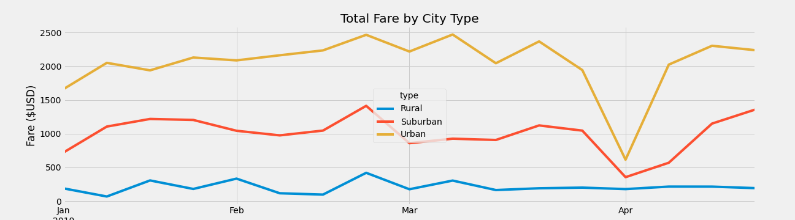

# PyBer_Analysis
Data analysis of PyBer, a ride sharing app.

## Resources 
Software: Python 3.8.8, JupyterLab 2.3.

## Overview
Our Ceo V. Isualize wants us to create a new analysis focusing on the fares for each city type to see if there are any correlations to fare and type of city. We will do this by collecting data from our city_data.csv and ride_data.csv. Then using said data, we will create a visual graph and find ways to improve PyBer’s success!

## Results

This is a brief summary of the data collected. 

After collecting and organizing the data between city types and comparing how the fares, drivers, and riders differ. Creating this graph containing all the data from January through May of 2019.

 

As it can be seen from both images, rural cities had the highest fare averages in both riders and their drivers. Urban cities had the lowest fares for both riders and drivers. This low number is likely due to shorter commute times and better public transportation in urban types. Urban cities also produced the most profit of the three types of cities, over 60%.

It becomes clear from the data that there is a relationship between fares and the number of drivers. The more drivers in the area mean fares are lower and fewer drivers mean fares are higher. This is likely due to the longer commutes in rural cities, leading to drivers taking longer to complete a service and can slow down how many riders the driver can take during their shift.

## Summary
After reviewing the data, I find that it would be in PyBer's best interest to invest more in rural city drivers. Due to the longer commute times, adding drivers will give more access to driver options and promote more use in rural areas. Increasing the drivers in rural areas will incrementally decrease the average fare. Lower rates will promote more business to these city types too. This can also benefit the rural cities as public transportation isn't always an option for an individual.
Another idea could be promoting a destination, to promote the use of PyBer. This could be done by promoting discounts for certain destinations. For example, the NFL is playing on Saturday and any rider who takes PyBer to the game can get a discount up to a certain mileage. This can be helpful in more urban and suburban cities to compete better with public transportation and other ride-sharing apps.
PyBer has a great chance to grow and become stronger as a company. Investing in these rural areas will help increase profits and create a better PyBer experience. Creating promotions for riders to use the app to get to certain events and such will incentivize more riders to use the app. By improving in these areas PyBer will become an even stronger company.
